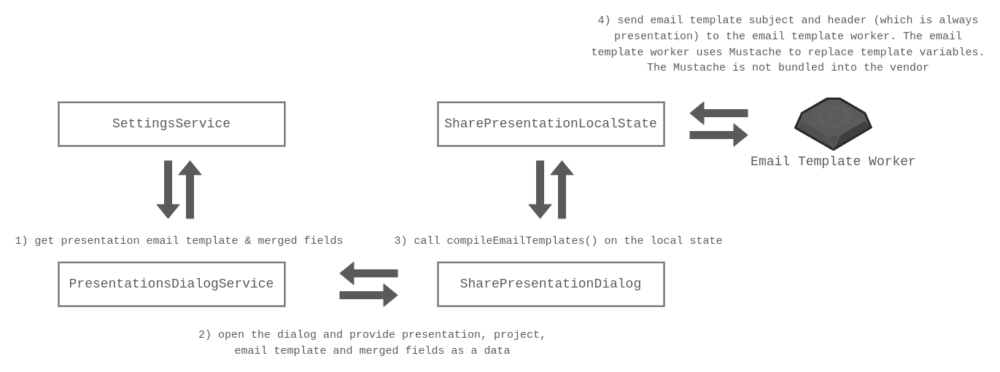

## API

This library exposes a single function called `compileEmailTemplatesOnWorker`. The only thing you need to do is call this function and pass a message (that is sent to the worker thread).

It sets up a worker which bundles the `mustache` package so it doesn't get bundled into the vendor. The worker also needs merged fields to validate the context (which will be used for rendering). The worker will throw an error if there's some missing field. The error at least will tell us that some field is missing. This is because merged fields can be updated on the backend, and we might not know that we need to make the following updates on the frontend.

The `compileEmailTemplatesOnWorker` returns an observable that emits a message from the worker only once (then completes and terminates the worker):

```ts
import {
  EmailTemplateToWorkerMessage,
  compileEmailTemplatesOnWorker,
} from '@esp/presentations/util-email-template-worker';

const message: EmailTemplateToWorkerMessage = {...};

compileEmailTemplatesOnWorker(message).subscribe(({ data }) => {
  console.log(data);
});
```

## Maintenance Notes

Let's take the `share-presentation` dialog as an example.

The `share-presentation` dialog requires email template fields like `subject` and `header` to be provided. So the algorithm is the following:

- load presentation email template
- load merged fields and get presentation merged fields
  - map merged fields to the `Code` property, so we receive `string[]` at the end
- pass it as a data
- call `state.compileEmailTemplates()`


